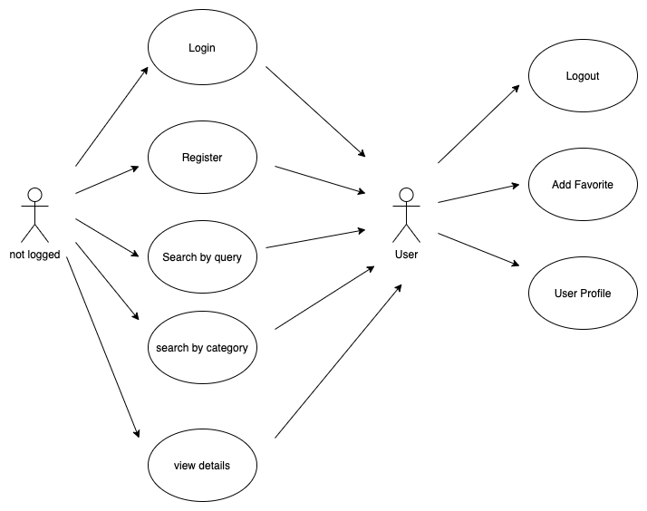
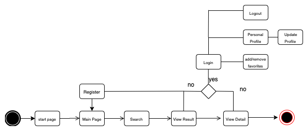
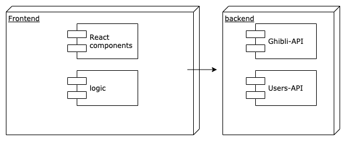
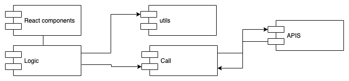
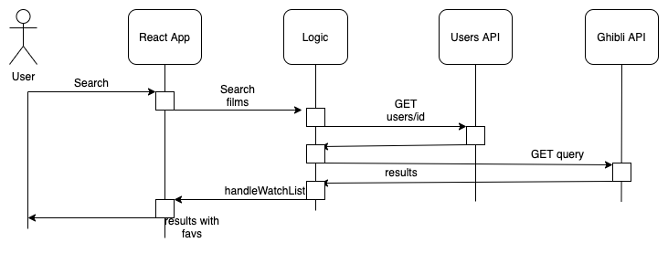
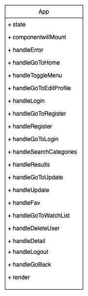
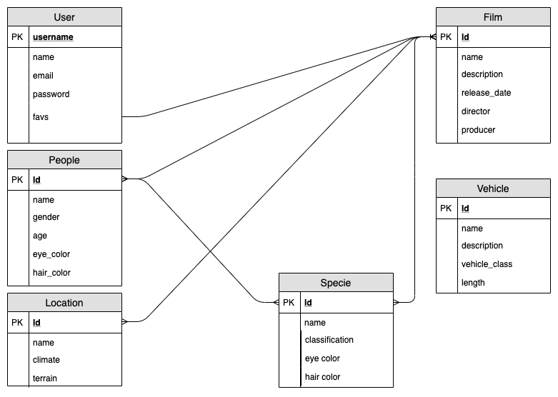

# Introduction

GHIBLI GUIDE is a minimal styled app that catalogs the people, places, and things found in the worlds of Ghibli. It is made to be intuitive and user-friendly. The benefits of signing up are that you can add your favourite films to your watchlist.

## Functional Description

You can search directly by category all the ghibli films, vehicles, people, species and locations. Search by query input is also permitted.
The App has the functionality to add your favourite films to your watchlist from results list and from details films. It lets you manage your user profile.

## Features

<ul>
    <li>Search by query</li>
    <li>Search by categories
        <ul>
            <li>Films</li>
            <li>People</li>
            <li>Species</li>
            <li>Vehicles</li>
            <li>Locations</li>
        </ul>
    </li>
    <li>View details</li>
    <li>Register</li>
    <li>Login</li>
    <ul>
        <li>Add films to watchlist</li>
        <li>Manage user profile</li>
        <li>Logout</li>
    </ul>
</ul>

### [Use Cases] 

### [Flows] 

## Tecnical Description

### [Block] 

### [Modules]

### [Sequence]

### [Class]

### [Data Model]

### [Trello]

https://trello.com/b/Kwn6CUAP/ghibli

